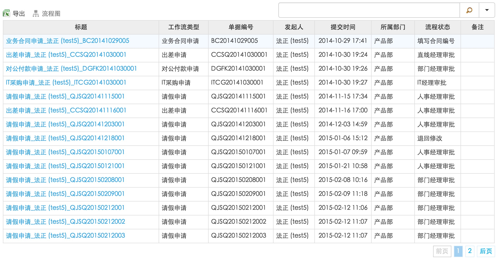
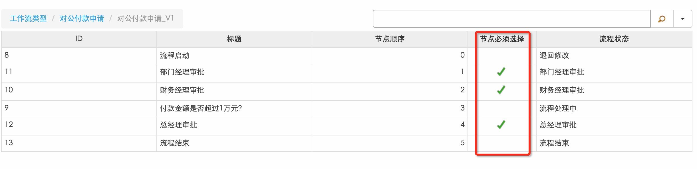

# 如何自定义列表控件的列内容转换器？
水杉工作流平台上的列表控件，包含以下三种控件：

``` c#
ShuiShan.S2.WebControls.DataGrid
ShuiShan.S2.Form.WebControls.ListDataGrid
ShuiShan.S2.Form.WebControls.ListSubtable
```
列表控件的基本呈现模式如下：


以上控件均可接受`DataTable`作为数据源，其中`DataTable`的`DataColumn`作为列表控件列的基础。在列表控件渲染过程中，控件会根据`DataColumn`的类型自动决定呈现内容的格式，比如文本类型，数字类型，日期类型等。但在实际项目开发过程中，我们需要定制某一列的UI呈现样式，让数据看起来更加醒目和生动。比如下图红框中，是定制过的Bool类型列的呈现样式：


实现自定义列内容转换器分两步：

- 定义列内容转换器
- 应用列内容转换器

## 定义列内容转换器
列内容转换器基类：

``` c#
//位于ShuiShan.S2.dll的ShuiShan.S2.WebControls命名空间下
ShuiShan.S2.WebControls.DataGridColumnConverter
```

自定义内容转换器类实现，以图二中的Bool类型列为示例说明：

``` c#
    /// <summary>
    /// Bool类型数据呈现为Icon的内容转换器。
    /// </summary>
    public class BooleanCellConverter : DataGridColumnConverter
    {
    	 //
        private string _iconClass;
        //inconClass: 用于Icon显示的样式名称，这样可以通过前端css控制显示。
        public BooleanCellConverter(string iconClass)
            : base()
        {
            _iconClass = iconClass;
        }
	    /// <summary>
    	 /// 最重要的重载方法，数据显示处理全在这里。
    	 /// </summary>
        protected override void Process()
        {
        		//_iconClass: 实例化转换器时传递的样式名称
        		//Row[Name]: Row是在内容转换过程中的DataTable某一行数据实例，是DataRow类型。Name是ColumnName。
            if (string.IsNullOrEmpty(_iconClass) || Column == null || Row[Name] == null || string.IsNullOrEmpty(Row[Name].ToString()))
            {
                base.Process();
                return;
            }
			  //获取转换过程中当前行以Name命名的Column Cell的值，在这里是bool类型的值。
            bool r = bool.Parse(Row[Name].ToString());
            //用于保存原始值的属性
            this.Value = r.ToString();
            if (r)
            {
            		//用于保存转换后显示值得属性，在这里就是把值为True的Cell转换为一个a标签并且附上特殊样式。
                this.Display = string.Format("<a class='{0}'></a>", _iconClass);
            }
            else
            {
                this.Display = string.Empty;
            }
        }
    }
```

就这样，一个最基本的自定义列内容转换器就定义好了，接下来看看如何使用。

## 应用列内容转换器
一般说来，我们在基于`ShuiShan.S2.Form.SSFormBase`基类的表单界面上去应用列内容转换器。其中，表单界面上存在一个基于`ShuiShan.S2.WebControls.DataGrid`类的列表控件。在表单界面后台类中`CreateChildControls`方法中应用转换器，示例代码如下：

``` c#
protected override void CreateChildControls()
{
	//listDataGrid：表单界面上ShuiShan.S2.Form.WebControls.ListDataGrid实例。
	//c.Name: DataColumn列名，在这里由于是ListDataGrid，所以是列表字段定义对应的InternalName。
	if (listDataGrid.Columns.Exists(c => c.Name == "BoolField")
	{
		listDataGrid.Columns["BoolField"].Coverter = new BooleanCellConverter("ss-icon-yes ss-active");
	}
}
```