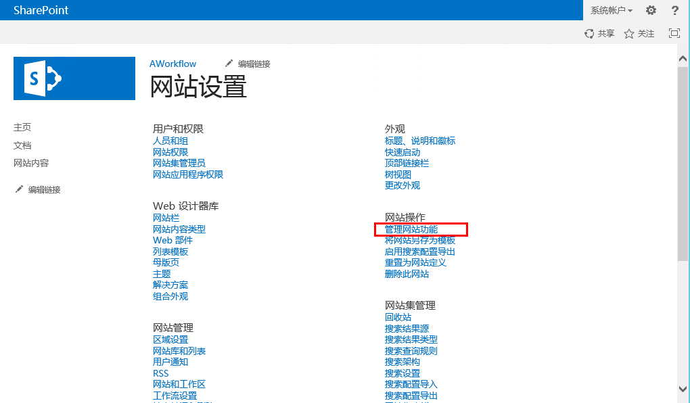
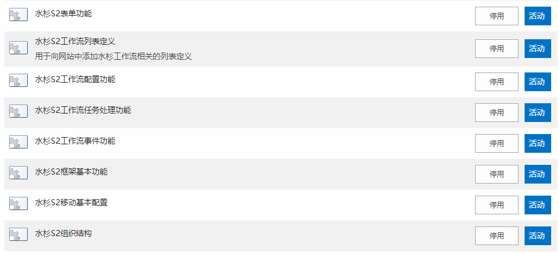
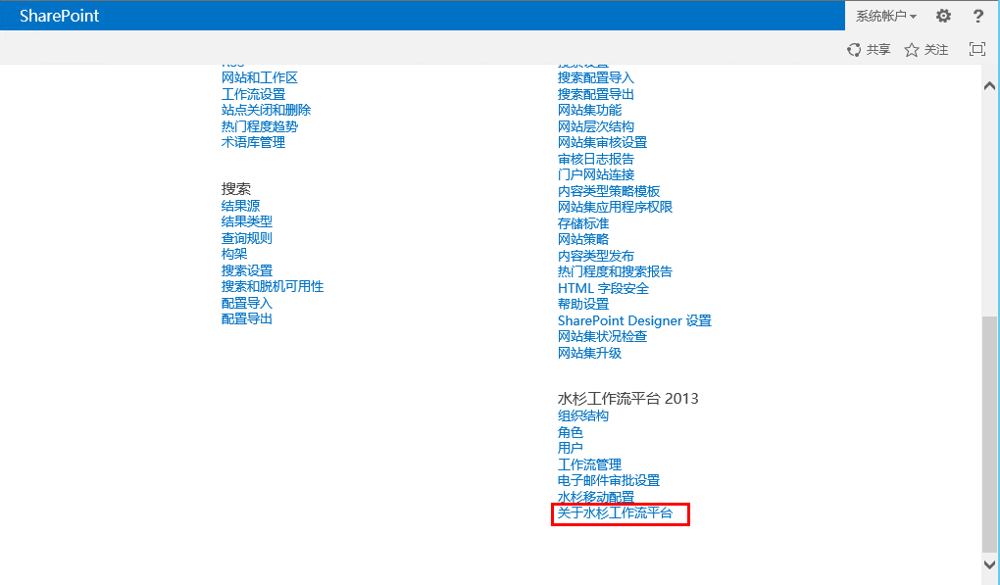
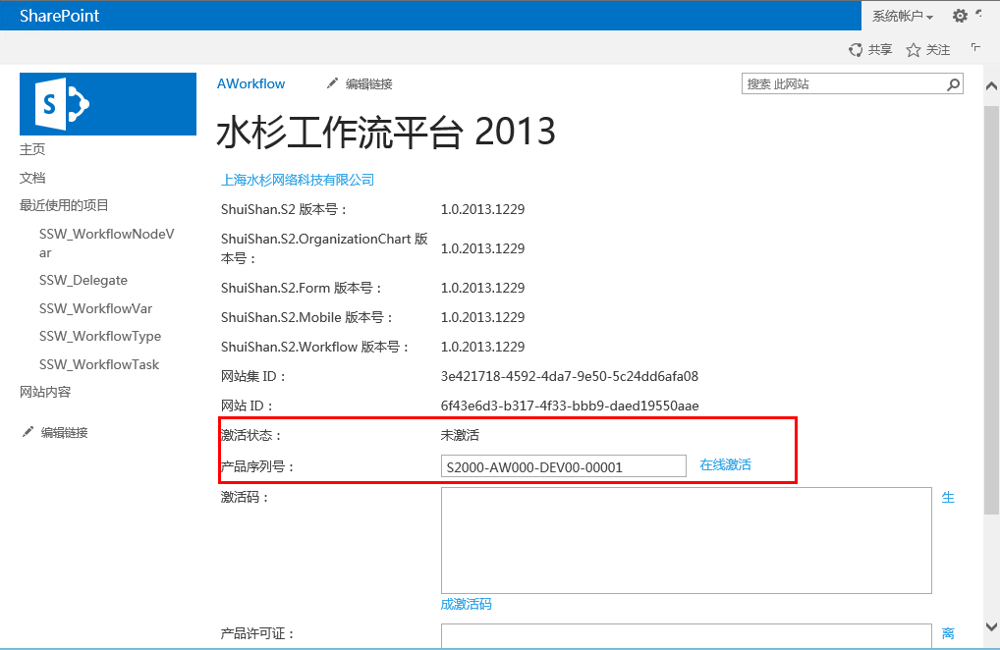
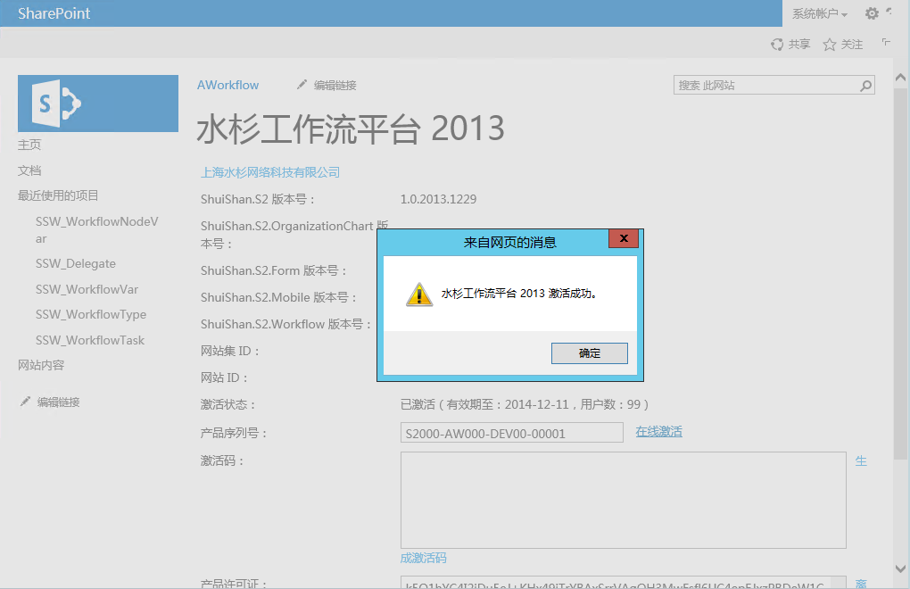
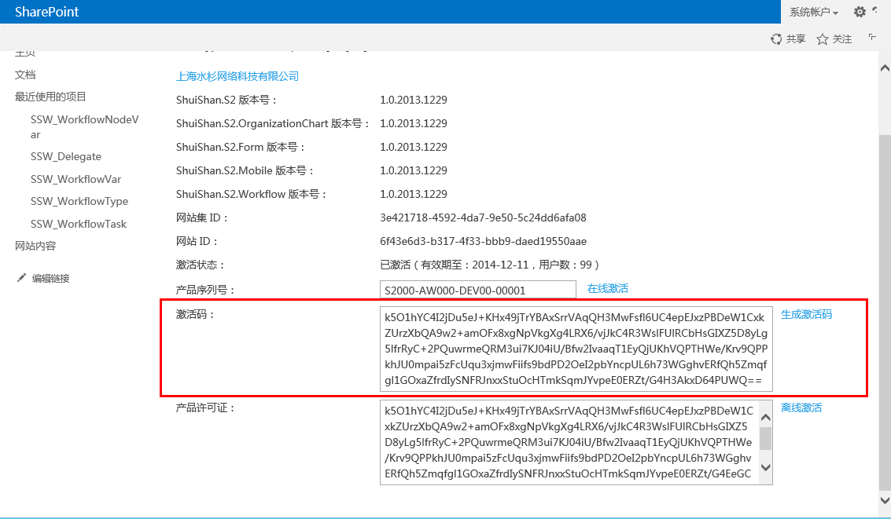

## 激活
>本节主要介绍`AWorkflow 2013`的网站功能激活和产品许可证激活。

### 激活网站功能
>此步骤目的是确保`AWorkflow 2013`的所有功能在网站上部署成功。

1. 打开需要安装`AWorkflow 2013`的SharePoint网站，打开网站设置页面：

2. 点击**管理网站功能**链接，进入网站功能管理页面：

3. 确保以下功能全部处于激活状态：
	* 水杉S2表单功能
	* 水杉S2工作流列表定义
	* 水杉S2工作流配置功能
	* 水杉S2工作流任务处理功能
	* 水杉S2工作流事件功能
	* 水杉S2框架基本功能
	* 水杉S2移动基本配置
	* 水杉S2组织结构

### 激活AWorkflow
> 此步骤目的是为了激活`AWorkflow 2013`产品，确保您拥有`AWorkflow 2013`产品的合法使用权利。

1. 打开已经安装`AWorkflow 2013`的SharePoint网站，打开**网站设置**页面：

2. 在**网站设置**页面下半部分，有一个`水杉工作流平台 2013 `的分组，点击此分组中的**关于水杉工作流平台 **链接：

3. 在**关于水杉工作流平台 **的页面上可以查看以下信息：
	* AWorkflow 2013平台组件的版本号。
	* AWorkflow 2013平台状态，是否已经激活。
4. 在线激活，需要服务器有访问互联网的权限，如果您是评估产品或者想使用开发者版本，则使用产品序列号**S2000-AW000-DEV00-00001**，如果您是专业版用户，则输入水杉公司提供的专有产品序列号，点击在线激活按钮：

正常情况下，激活成功会有以下提示，状态改变为已激活：

5. 离线激活，如果服务器不能访问互联网，则可以使用离线激活。和在线激活一样，需要输入正确的产品序列号，然后点击**生成激活码**，发送生成的激活码到[aworkflow@shuishan-tech.com](mailto:aworkflow@shuishan-tech.com)，一个工作日内我们会回复邮件提供产品许可证。

到这里，`AWorkflow 2013`就在您的SharePoint网站上正式启用，你可以管理工作流，管理组织结构，创建表单等，具体的操作手册以下一一呈现。
