水杉组织结构操作使用说明

- <a href="#C1">角色定义</a> 
- <a href="#C2">组织结构定义</a>
- <a href="#C3">用户设定</a>

---

用户可以利用水杉工作流平台的组织结构管理功能进行企业组织结构的设置，以便用于工作流定义过程中。组织结构定义包含以下几部分的工作：

- 部门结构定义 – 以树状结构定义企业的部门结构，并在部门上设置角色信息；

- 用户列表定义 – 定义工作流系统中使用的用户相关信息；

- 角色定义 – 定义工作流系统中能够使用的角色相关信息。

#角色定义#

<a href="#Top">Top</a>

从网站设置页面点击“水杉工作流平台2013/角色”链接，进入“角色”管理页面。在角色管理页面中可根据实际流程需要建立角色名称列表。

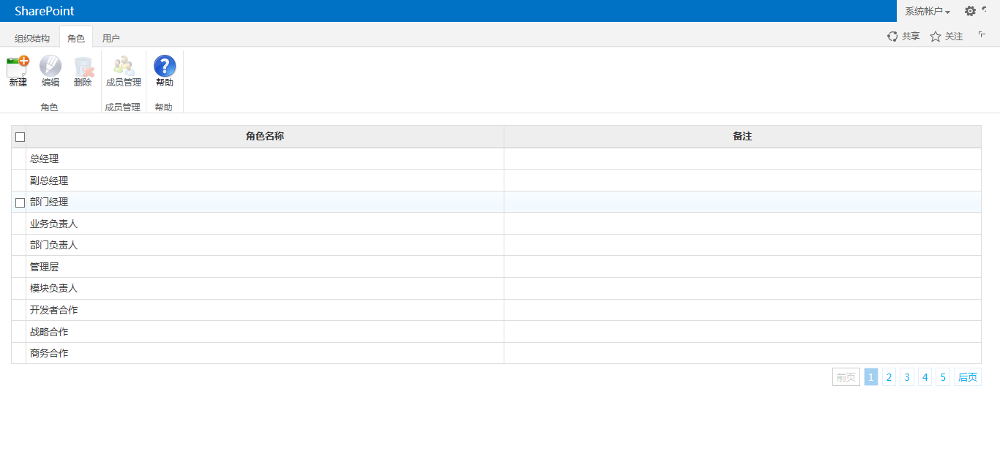

**创建和编辑角色**

点击`新建`按钮，或选择角色后点击`编辑`按钮，可以开始创建或编辑角色，如下图所示：

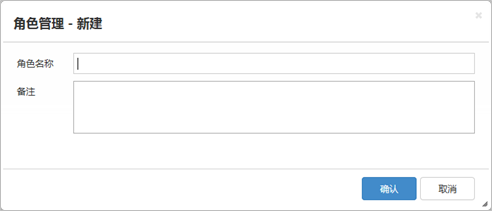

**删除角色**

在角色列表中选择需要删除的角色后，点击`删除`按钮。*已经分配了成员用户的角色不可以被删除。*

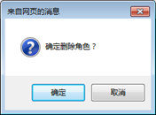

**成员管理**

角色可以关联公司或部门以及成员用户，例如：“部门经理”角色可以关联不同部门，并在每个部门上关联不同部门的部门经理成员用户，从而构成“公司/部门-角色-用户”关系。

在角色列表中选择角色，并点击`成员管理`按钮，在弹出窗口中列出当前组织结构已经定义的“公司/部门-角色-用户”关系列表。

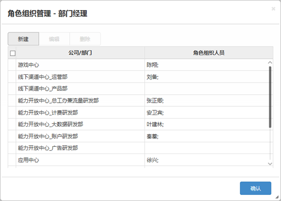

点击`新建`按钮，可以创建一个新的“公司/部门-角色-用户”关系。首先从现有组织结构中选择一个公司或部门，然后点击`添加成员`按钮向这个关系中添加成员用户。编辑完成后点击`确认`按钮保存新建的“公司/部门-角色-用户”关系。

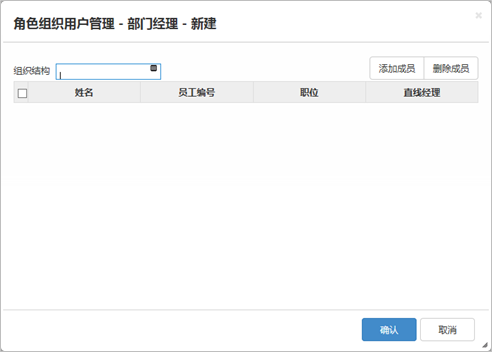

点击`编辑`或`删除`按钮，可以编辑或删除已存在的“公司/部门-角色-用户”关系。

#组织结构定义#

<a href="#Top">Top</a>

从网站设置页面点击“水杉工作流平台2013/组织结构”链接，进入“组织结构”管理页面。在组织结构管理页面中，可以建立“公司\子公司\部门\子部门”的层级状组织结构。

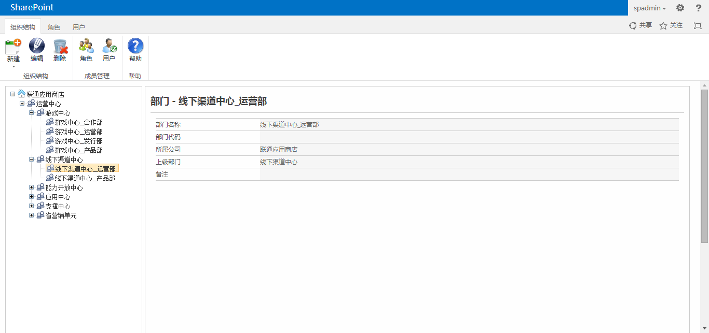

**创建公司和子公司**

点击『新建』按钮，选择“新建同级公司”，则可在当前光标选择的组织结构层级上创建同级别的公司。如果是点击在根目录所在的公司上，则同样创建一个根目录级别公司（无上级公司）。

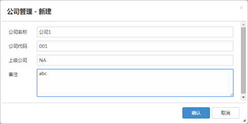

选择组织结构中的公司，点击『新建』按钮并选择“新建子公司”，则可开始创建当前所选择公司的子公司。

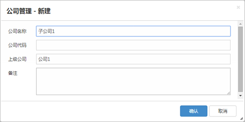

**创建部门和子部门**

部门只能在公司下创建。在组织结构中选择公司，点击`新建`按钮并选择`新建同级部门`，则可开始创建所选择公司下属部门；在组织结构中选择部门，点击`新建`按钮并选择`新建同级部门`，则可开始创建所选择部门的同级部门；在`新建`按钮中选择`创建子部门`，则可创建当前选择的公司或部门的下级部门。

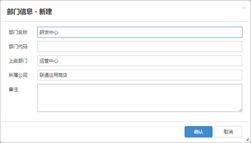

**删除公司或部门**

在组织结构中选择公司或部门，并点击`删除`按钮，系统将提示用户是否确认要删除所选择的公司，并可勾选“是否删除所有下级组织结构？”。

如果用户不勾选“是否删除所有下级组织结构？”选项，并确认删除，则将删除选中的公司或部门，并将被删除的公司或部门的下级组织结构上移到被删除的位置。

如果用户勾选“是否删除所有下级组织结构？”选项，并确认删除，则将删除选中的公司或部门，以及其下属的所有公司或部门。

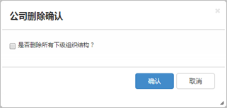

**“公司/部门-角色-用户”关系定义**

在组织结构中选择公司或部门，并点击`角色`按钮，可以开始定义该公司或部门节点上的“公司/部门-角色-用户”关系。在弹出窗口中列出当前选择的公司或部门节点上已经定义的角色和用户。

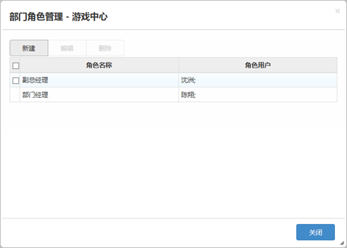

点击`新建`按钮创建新的“公司/部门-角色-用户”关系。从角色名称列表中选择角色名称或点击`添加角色`按钮添加一个新的角色名称，然后点击`添加成员`按钮添加成员用户。编辑完成后点击`确认`按钮保存新建的“公司/部门-角色-用户”关系。

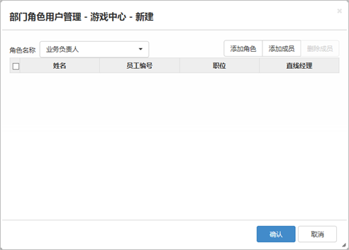

点击`编辑`或`删除`按钮，可以编辑或删除已经存在的“公司/部门-角色-用户”关系。

**“部门-用户”关系定义**

在组织结构中选择部门节点，并点击`用户`按钮，可以开始定义该公司或部门节点上的“部门-用户”关系。在弹出窗口中列出当前选择的部门节点上已经定义的用户列表。

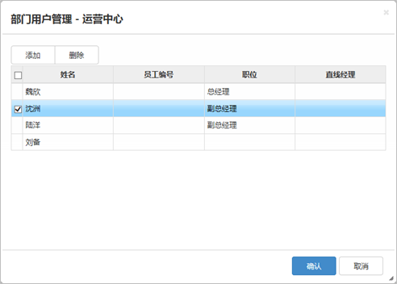

点击`添加`按钮可以在当前选择的部门节点上添加成员用户。点击`删除`按钮可以将选中的成员用户从当前部门移除。

#用户信息设定#

<a href="#Top">Top</a>

从网站设置页面点击“水杉工作流平台2013/用户”链接，进入“水杉工作流平台用户管理”页面，如下图：

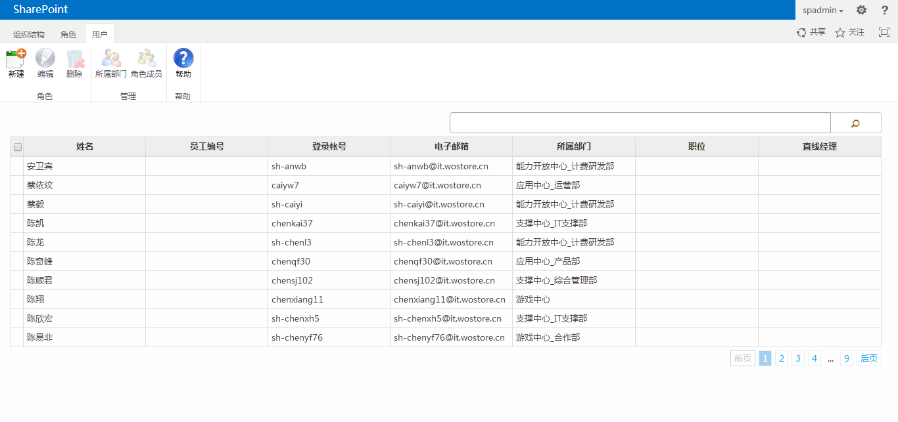

**新建/编辑用户**

在用户列表页面中点击`新建`按钮，可以开始新建用户；在用户列表中选择用户，并点击`编辑`按钮，可以开始编辑用户信息。

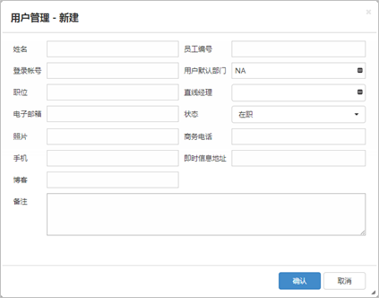

用户信息包含下列属性：

- 姓名 – 文本输入，255字符；

- 员工编号 – 文本输入，255字符；

- 登录帐号 – 员工登录SharePoint使用的帐号名称；需注意如果用户不是来自于不同AD域，则登录账号前不需要包含域名，例如：用户的登录账号为“domain\username”，在本系统中只需要登记为“username”；

- 用户默认部门 – 从组织结构中选择并设定用户所属的默认部门；

- 职位 – 文本输入，255字符；

- 直线经理 – 选择并设定用户的直线经理；

- 电子邮箱 – 设定用户的电子邮件；

- 状态 – 选择用户的在职状态，新建用户默认状态为“在职”；

- 照片 – 设定用户照片的链接地址；

- 商务电话 – 设定用户的商务电话号码；

- 手机 – 设定用户的手机号码；

- 即时信息地址 – 设定用户的即时信息地址；

- 博客 – 设定用户的博客地址；

- 备注 – 设定用户的个人简介或其他相关的备注信息。

**删除用户**

从用户列表中选择用户并点击`删除`按钮，确认后可将当前选择的用户删除。

**所属部门设定**

从用户列表中选择用户并点击`所属部门`按钮，可编辑当前所选择用户的所属部门。从组织结构中选择部门，并点击`添加`按钮，可以添加用户所属部门。选择用户所属部门并点击`删除`按钮，可以移除用户所属部门。用户的默认所属部门在这个页面中不能修改，只能在用户信息编辑中修改。

**所属角色成员管理**

选择用户后点击`角色成员`按钮，可以对该用户所属的“公司/部门-角色-用户”关系进行管理。从左侧树状结构中选择已经存在的““公司/部门-角色”关系并点击`添加`按钮。从右侧列表中选择当前用户所属的角色并点击`删除`按钮。

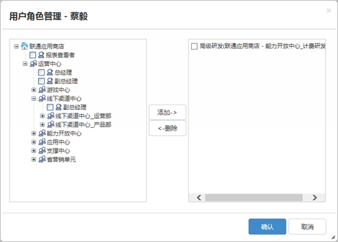

<a href="#Top">Top</a>

---

上海水杉网络科技有限公司 &copy; 版权所有

