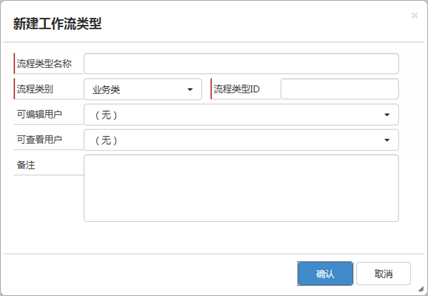
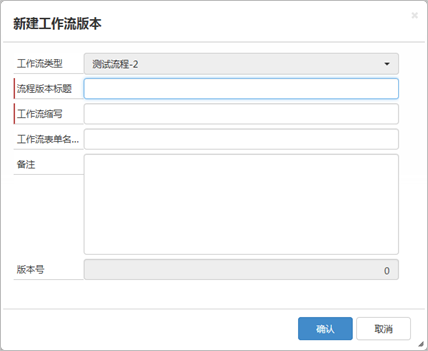
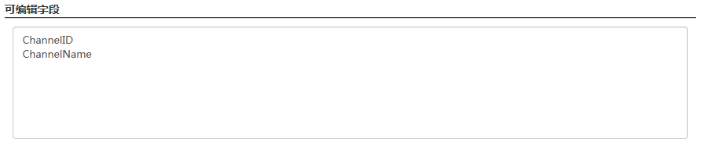
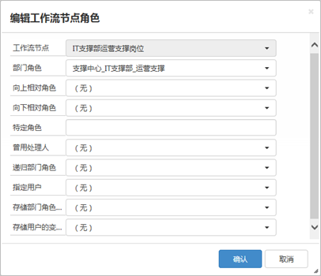
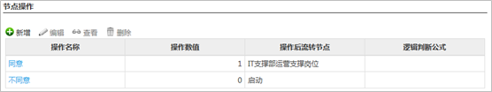
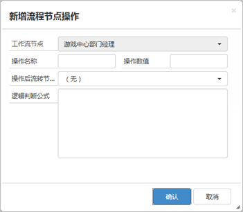

**水杉工作流平台操作使用说明**

- <a href="#C1">概述</a> 
- <a href="#C2">流程定义过程</a>
	- <a href="#C21">工作流类型管理</a>
	- <a href="#C22">工作流版本管理</a>
	- <a href="#C23">工作流设置</a>
		- <a href="#C231">工作流节点设置</a>
		- <a href="#C232">工作流节点角色</a>
		- <a href="#C233">工作流节点操作</a>
	
---
#概述#

<a href="#Top">Top</a>

水杉工作流平台是架构于SharePoint平台之上的企业工作流管理平台。水杉工作流由下列元素构成：

* 工作流类型
* 流程版本
* 流程节点
* 节点操作
* 节点角色
* 工作流变量

工作流类型是对流程的分类，每个工作流类型中均可包含多个流程版本，其中一个是当前实际运行的版本，通常是版本号最大的一个（流程版本号由系统维护自动增加）。在系统运行过程中，用户可随时将实际运行版本复制为草稿版本，并对流程进行调整和发布。最新发布的流程版本将取代前一个版本成为流程当前实际运行版本。

流程版本中包含的实际流程，由流程节点以及和流程节点关联的流程角色和流程操作等共同构成。

工作流变量中可以记录和流程相关的业务数据，通过逻辑节点中对变量的逻辑比较，对流程走向发生影响。

在系统中已经启动的工作流实例将基于其启动时的实际运行版本流转完成，不受新发布的流程版本影响；新启动的流程则将基于最新的实际运行版本启动并流转。*例如：某流程类型的实际运行版本为“版本1”时，有流程启动则基于该“版本1”；当前一个流程实例还没有结束时，该流程类型下发布了新的版本为“版本2”，则前一个流程将基于“版本1”继续流转不受影响，而此时有新的流程发起则将基于“版本2”启动并流转了。*

#流程定义过程#

<a href="#Top">Top</a>

使用水杉工作流平台定义流程的操作一般分为两类，一类是新建流程并发布，另一类则是对现有流程进行修改和调整后再次发布。

新建流程并发布的过程如下图所示：

对现有流程进行修改和调整的过程如下图所示：

##工作流类型管理##

<a href="#Top">Top</a>

工作流类型是对工作流的基本分类，其中包含下列信息：

- 流程类型ID – 该字段是整数类型的数字字段，用于在工作流系统中对流程类型进行唯一的标识，在『工作流类型』中该字段不允许重复，并且在流程类型创建后该字段不允许被修改。

- 流程类别 – 该字段是文本类型字段，用于对流程类型的类别进行标识，通常可用于流程管理平台的导航菜单分类等；具体的流程分类方式和实际应用场景有关，系统管理员可以通过对『工作流类型』列表的『流程类别』列的定义进行修改从而满足实际应用场景下对流程类别的要求。

- 流程类型名称 – 文本类型字段可输入流程类型名称。

- 当前版本 – 流程当前可运行版本，该字段由流程发布功能维护，用户不可编辑。

- 可编辑用户 – 对该流程类型的表单拥有新建、编辑和查看权限的用户群体。

- 可查看用户 – 对该流程类型的表单拥有查看权限的用户群体。

- 备注 – 对流程类型进行文字说明。

**新建工作流类型**

在“工作流类型”列表中点击`新建`按钮，可以开始新建工作流类型，如下图所示。

**编辑工作流类型属性**

在“工作流类型”列表中选择工作流类型，然后点击`属性`按钮，可以编辑选中的工作流类型属性。

**删除工作流类型**

在“工作流类型”列表中选择工作流类型，然后点击`删除`按钮，可以删除选中的工作流类型。仅当工作流类型下没有已发布的工作流版本时，才允许被删除。

##工作流版本管理##

<a href="#Top">Top</a>

每个工作流类型均可对应多个工作流版本，并将其中一个版本设置为当前版本。工作流版本包含下列属性：

- 工作流类型 – 所属工作流类型，不可编辑；

- 流程版本标题 – 工作流类型名称加版本号自动生成；

- 工作流缩写 – 代表工作流类型的缩写名称；

- 工作流表单名称 – 发起该版本流程对应的工作流表单名称；

- 备注；

- 版本号 – 正式发布的版本号从1开始自动递增；未发布的版本编号均为0。

**新建工作流版本**

可通过两种方式新建工作流版本：

- 在流程版本列表上方点击`新建`按钮，开始创建一个全新的工作流版本，如下图所示：

 
- 在流程版本列表中选择某个已发布的版本后，点击`复制`按钮并确认，系统将自动把选中的流程版本的属性及其关联的节点、角色、操作、工作流变量等复制到一个新的草稿流程版本（版本号为0）。

**编辑工作流版本属性**

在流程版本列表中选择需要编辑的流程版本，然后点击`属性`按钮。

**删除工作流版本**

在流程版本列表中选择需要删除的流程版本，然后点击`删除`按钮。已发布的流程版本不可以删除。

**发布工作流版本**

在流程版本列表中选择需要发布的流程版本，然后点击`发布`按钮。仅有草稿版本（版本号为0）才允许发布，被发布的流程版本将变为所属工作流类型的当前版本，版本号自动被设置为发布前的最大版本号加1。

**设置工作流节点**

在流程版本列表中选择需要进行设置的流程版本，然后点击`流程节点`按钮，进入流程节点列表页面。

##工作流设置##

<a href="#Top">Top</a>

工作流设置是通过工作流节点、工作流节点操作、工作流节点角色以及工作流变量的设置，完成工作流程的定义过程。

工作流节点是工作流定义中的主要组成部分，节点包含了工作流流程中每一个工作步骤的主要操作。

工作流节点相关的工作流操作则体现了工作流节点之间的关系和流程走向。在审批/审阅节点上定义的工作流节点角色则限定了对每个审批/审阅节点进行操作的工作流用户或用户群体。

###工作流节点设置###

<a href="#Top">Top</a>

工作流节点包含下列类型：

- 流程启动 – 启动流程的节点，每个流程里只能有一个流程启动节点；

- 审批处理 – 产生审批任务的节点，流程将等待审批人员处理并提交审批任务后才会继续流转；

- 审阅处理 – 产生审阅任务的节点，审阅任务生成后流程将继续流转不作停留； 

- 逻辑判断 – 对流程变量进行逻辑判断，逻辑判断结果为”真“时，流程将会继续流转；否则流程将继续等待；

- 并发节点 – 流程中并发操作的结束节点，需要进行并发操作的节点如果要结束并发，则应将“操作后流转节点”指向一个并发节点；

- 流程结束 – 结束流程的节点，同时将本流程中相关且未结束的所有节点和审批任务的状态设置为“取消”。

工作流节点属性：

- 节点顺序 – 启动类型节点的节点顺序必须设置为0；其他类型节点不限制，节点顺序的主要作用是控制节点在流程节点列表的显示顺序；

- 节点名称 – 使用文本输入，对节点的主要操作进行基本的标记；

- 流程状态 – 从流程状态列表选择，流程进入该节点后将根据节点设置的流程状态设置工作流的当前状态。
	
	- 如果流程中允许退回发起人进行修改，则启动节点的流程状态通常选择为“退回修改”（*流程第一次启动进入流程启动节点时，状态自动设置为“流程启动”；流程退回到启动节点，也即第二次进入流程启动节点时，会根据节点的流程状态设置流程的当前状态*）；
	
	- 如果流程允许发起人中止，则可设置“流程中止”节点，其流程状态通常可设置为“流程中止”；

	- 流程结束节点的流程状态通常设置为“流程结束”；

	- 其他流程节点的流程状态可设置为“流程处理中”，或根据实际业务需求在流程状态列表中增加相应的状态并在流程节点中加以设置。

- 审批类型 – 仅适用于“审批处理”类型的流程节点

	- 1 = 单人审批：该节点的审批任务即使分配给多个用户，也将在任何用户对任务进行处理的以后继续流转，同时取消相同节点上分配给其他用户未处理的任务；
	
	- 2 = 并行审批：该节点的审批任务将同时分配给1至多个用户，并将在所有用户均选择“同意”（或操作数值等于1的审批意见）后，或任何用户选择了“不同意”（或操作数值等于0的审批意见）后，才继续流转。

	- 在并行审批的情况下，只允许设置两个流程操作，并且操作数值分别等于1和0；所有用户选择了“同意”后，则流程向审批意见为“同意”的操作路径继续流转；任何用户选择了“不同意”，则流程向审批意见为“不同意”的操作路径继续流转。

- 任务分发类型 – 代表前一节点审批处理人员选择后一个审批或审阅处理类型节点的审批人时的选择模式。此选项仅前一个节点为审批处理类型节点，其后续处理节点为审批或审阅处理类型节点时才有效。

	- 1 = 角色：仅选择角色列表；

	- 2 = 用户：先选择角色列表，再选择用户。

- 最少并行审批数量 – 该属性用于规定后一个流程节点为并行审批情况下，前一个审批处理节点的处理人员至少应选择的后续审批人员数量，仅对审批类型等于并行审批的审批处理类型节点有效。

- 上传附件 – 该属性用于规定该流程节点的审批处理人员是否需要上传附件，仅对审批处理类型节点有效。
	- 1 = 不需要：审批处理人员不需要上传附件，上传附件的功能也将对该节点的审批处理人员隐藏；
	
	- 2 = 可选：审批处理人员可以上传附件，但系统不做检查；

	- 4 = 必须上传：审批处理人员必须上传附件，否则无法提交审批意见。

- 填写审批说明 – 该属性用于规定该流程节点的审批处理人员是否需要填写审批说明，仅对审批处理类型节点有效。
	- 1 = 不需要：审批处理人员不需要填写审批说明，填写审批说明的功能也将对该节点的审批处理人员隐藏；

	- 2 = 可选：审批处理人员可以填写审批说明，但系统不做检查；

	- 4 = 必须上传：审批处理人员必须填写审批说明，否则无法提交审批意见。
- 是否发送通知 – 该属性用于规定进入该流程节点时是否给审批或审阅任务处理人员发送邮件或短信通知。

- 节点处理代码 – 该属性用于填写针对该节点事件进行处理的后台代码名称。

- 可编辑字段 – 该属性用于填写在该节点上开放给审批处理人员填写的工作流单据字段名称，每个字段名称一行。业务单据字段名称可以直接填写SharePoint列表字段的定义名称（注意：不是显示名称）如下图所示：

	- 工作流基本信息字段按照下列名称填写：
		- SSW_Workflow.Title – 工单标题；			
		- SSW_Workflow.Memo – 工单描述；		
		- SSW_Workflow.ExpectedFinishDate – 预期完成时间；			
		- SSW_Workflow.WorkflowStatus – 工单结束状态；			
		- SSW_Workflow.Attachment – 工单附件；
		- SSW_Workflow.ContactPhone – 联系电话；

	- 特殊字段控制
		- Attachment - 列表附件字段；
		- 其他的附件字段，可通过设定字段名称控制；

	- 子表控制，按照下面的格式填写需要控制的子表名称：
		- /Lists/子表名称（ListURL）

- 电子邮件模板 – 该属性用于填写在该节点上发送的电子邮件模板。

- 短信模板 – 该属性用于填写在该节点上发送的短信通知模板。

- 备注 – 该属性用于对该节点功能的描述加以记录。

###工作流节点角色###

<a href="#Top">Top</a>

流程启动、审批或审阅处理类型的工作流节点需要且必须进行角色设定，以决定流程流转到该节点时生成的审批或审阅任务应分发给哪个（些）用户。

在流程节点列表中选择需要设定角色的审批或审阅处理类型节点后，点击`角色`按钮进行工作流节点角色设定，如下图所示：

工作流节点角色设定包含下列属性：

- 部门角色 – 选择和部门关联的角色名称，允许多选；

- 向上相对角色 – 选择角色名称，允许多选；向上相对角色是指从发起人默认所属部门开始（包含发起人默认所属部门），延组织结构梳妆结构向上寻找到的第一个角色名称等于所选择角色名称的部门角色；

- 向下相对角色 – 选择角色名称，允许多选；向上相对角色是指从发起人默认所属部门开始（包含发起人默认所属部门），延组织结构树状结构向下寻找到的所有角色名称等于所选择角色名称的部门角色合集；

- 特定角色

	- 1 = 包含的所有角色：审批任务处理人默认所属部门下包含的所有角色；
	
	- 2 = 发起人：该节点将分发给发起人处理；流程启动节点的角色通常设置为特定角色=2，也即流程退回启动节点时，由发起人进行处理。

**注意：启动类型节点的角色设定必须设定为“特定角色=2”，也即流程返回启动节点时由发起人负责处理。**

- 曾用处理人 – 在该流程节点使用当前流程已经启动过的流程节点所使用的处理人员；

- 递归部门角色 – 系统保留值；

- 指定用户 – 系统保留值；

- 存储部门角色的变量 – 系统保留值；

- 存储用户的变量 – 系统保留值。

###工作流节点操作###

<a href="#Top">Top</a>

工作流节点操作代表流程节点后续的不同操作，也即流程节点处理完成后的流程走向。在编辑工作流节点窗口的“节点操作”区域可以进行工作流节点操作的设定。

**新增工作流操作**

在“节点操作”列表中点击`新增`按钮，开始创建新的工作流操作，如下图所示：

**编辑/查看工作流操作**

在“节点操作”列表中选择需要编辑或查看的工作流操作，并点击`编辑`或`查看`按钮。

**删除工作流操作**

在“节点操作”列表中选择需要删除的工作流操作，并点击`删除`按钮。

工作流操作包含下列属性：

- 操作名称 – 操作名称可手工输入，在审批处理类型节点中，操作名称即对应审批处理用户可选择的审批处理意见选项；

- 操作数值 – 可使用1或0，通常使用1代表同意类型的操作，0代表拒绝或不同意类型的操作；操作数值仅适用于并行审批类型的节点。在并行审批类型的节点上必须且只能够设置两个流程操作，且操作数值分别等于1和0；

- 操作后流转节点 – 在流程流转过程中系统或审批用户选择了当前操作后，流程继续的下步节点，可以多选。如果选择了多个操作后流转节点，则代表这些节点将在本操作完成后同步被启动；

- 逻辑判断公式 – 仅适用于逻辑判断类型的流程节点，用于保存当前流程操作被触发并继续执行的逻辑条件。

**逻辑判断公式**

逻辑判断公式用于工作流变量之间或工作流变量和常量之间的比较，返回True或False。 逻辑判断公式由“操作、左侧、右侧”三部分构成：

- 操作部分定义了此逻辑判断的比较符号；
- 左侧和右侧分别对应了需要进行比较的两个变量或常量。
		
		{
			OperationType: "操作类型"
			Left:
			{
				VarType: 变量类型
				ValueType: 变量值类型
				Name/Constant: "变量名称/常量值"
			},
			Right: 
			{
				VarType: 变量类型,
				ValueType: 变量值类型,
				Name/Constant: "变量名称/常量值"
			}
		}
		
	操作类型

		- Eq: 等于
		- Neq: 不等于
		- Gt: 大于
		- Geq: 大于等于
		- Lt: 小于
		- Leq: 小于等于
		

	变量/常量类型：

		- 0: 代表常量，直接在公式里定义
		- 1: 系统变量，系统级变量，和工单类型或具体工单无关
		- 2: 工单类型变量，工单类型关联的变量，和具体工单无关
		- 4: 工单变量，具体到每个工单的变量

	变量值类型：

		- 1: 文本
		- 2: 数字
		- 4: 日期时间
		- 8: 是否
		- 16: SharePoint用户变量
		- 32: SSO_User变量
		- 64: SSO_DepartmentRoleUser变量
		- 128: SSO_Department变量
		- 256: SSO_Company变量
	

	变量名称/常量值：

		- 变量则写为“Name:”，后面加上变量的名称，使用双引号("")标识
		- 常量则写为“Constant:”，后面加上常量的值，使用双引号（""）标识

	例1：是否类型变量和常量进行比较

		{
			OperationType: "Eq",
			Left: 
			{
				VarType: 4,
				ValueType: 8,
				Name: "HasContract"
			},
			Right: 
			{
				VarType: 0,
				ValueType: 8,
				Constant: "true"
			}
		}

	例2：两个文本类型变量进行比较

		{
			OperationType: "Eq",
			Left: 
			{
				VarType: 4,
				ValueType: 1,
				Name: "ContractNumber1"
			},
			Right: 
			{
				VarType: 4,
				ValueType: 1,
				Name: "ContractNumber2"
			}
		}
	
	例3：两个数字类型变量进行比较

		{
			OperationType: "Gt",
			Left: 
			{
				VarType: 4,
				ValueType: 2,
				Name: "Total1"
			},
			Right: 
			{
				VarType: 4,
				ValueType: 2,
				Name: "Total2"
			}
		}

<a href="#Top">Top</a>

---

上海水杉网络科技有限公司 &copy; 版权所有

