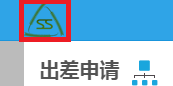
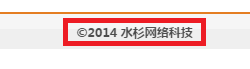
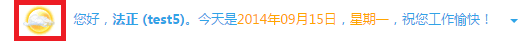
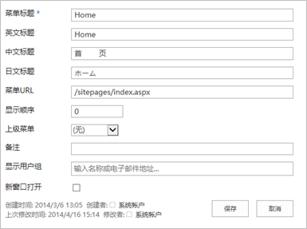
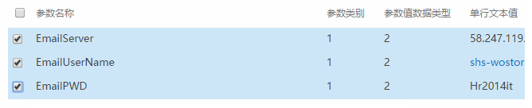
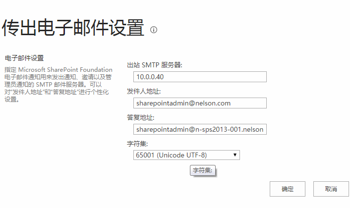
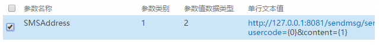

#工作流门户#

工作流门户是所有工作流用户登录系统并进行流程审批、单据填写、提交和查询的门户站点。

##基本参数##

###系统图标和版权信息设置###
系统图标包括在系统主页导航菜单栏上方左侧的企业图标，以及表单页面中左上方的图标。版权信息为系统页面页脚部分显示的公司及版权声明。

系统主页图标设置：『SSF\_Parameters』，参数名称：SSF\_Logo；

系统表单页面图标设置：『SSF\_Parameters』，参数名称：SSF\_PettyLogo；

版权声明：『SSF\_Parameters』，参数名称：SSF\_Copyright。

###天气预报地区设置###
在导航菜单栏上方右侧显示的天气预报图标，可根据需要自行设置显示天气预报的地区。
设置列表：系统参数表『SSF\_Parameters』，参数名称：SSF\_City。

##导航菜单##

导航菜单是指工作流门户首页顶部的横向菜单，菜单对应系统列表『SSF\_Menu』，设置地址为：http://servername/Lists/SSF_Menu/AllItems.aspx，其中的**`servername`**需要替换为实际的工作流服务器名称以及相应的站点地址和端口号（如果有的话）。

进入列表后，可点击`新建`按钮创建一个新的菜单项目，如下图所示：

系统菜单包含下列属性设置：

* 菜单标题 – 文本设置，仅用于区分菜单项目，不用于显示；
* 中文标题 – 文本设置，用于显示；
* 菜单URL – 设置菜单链接；
* 显示顺序 – 该菜单项在其所处的级别中的显示顺序；
* 上级菜单 – 如果是顶级菜单则不需要设置此字段，子菜单则选择其上级菜单项目；
* 备注 – 文本设置，不用于显示；
* 新窗口打开 – 选择这个选项则该菜单链接点击后在新窗口中打开页面；否则在同一个窗口转向菜单链接。

##单据列表##

在工作流门户中的各种类型的单据列表设置方法如下：

* 我审批的申请 - 等待审批

		『SSW_Workflow』列表.SSPending视图 +『SSW_WorkflowTask』.SSPending视图

* 我审批的申请 - 已审批
* 
		『SSW_Workflow』列表.SSProcessed视图 +『SSW_WorkflowTask』.SSProcessed

* 我审批的申请 - 待阅
* 
		『SSW_Workflow』列表.SSReviewing视图 +『SSW_WorkflowTask』.SSReviewing视图

* 我审批的申请 - 已阅

		『SSW_Workflow』列表.SSReviewed视图 +『SSW_WorkflowTask』.SSReviewed视图

* 我发起的申请 - 草稿箱
 	
		『SSW_Workflow』列表.SSDraft视图 

* 我发起的申请 - 进行中

		『SSW_Workflow』列表.SSUnfinished视图 

* 我发起的申请 - 已完成

		『SSW_Workflow』列表.SSFinished视图

* 特定单据列表

		『SSW_Workflow』列表.SSWorkflow视图 + 特定单据列表.SSListDataView视图
		
	如果某个单据列表同时对应多个流程，不同流程列表希望显示的字段不同，则为希望展示特别字段的流程创建专门的SSListDataView视图，并在视图名称后增加“\_工作流类型ID”；例如：SSListDataView\_14，对应工作流类型ID=14的流程列表的展示。

#工作流通知#

##电子邮件提醒##

水杉工作流平台的电子邮件服务使用两种方式进行设置，系统将优先读取『SSF\_Parameters』列表中设置的参数，如果在『SSF\_Parameters』列表中未设置，则读取管理中心的“传出电子邮件设置”。

**SSF_Parameters参数**

* EmailServer：外部SMTP邮件服务器名称或IP地址；
* EmailUserName：系统连接SMTP邮件服务器时使用的验证用户名称；
* EmailPWD：SMTP邮件服务器验证用户的密码。

**传出电子邮件设置**

进入SharePoint管理中心，系统设置/传出电子邮件设置，设置下列参数：

* 出站SMTP服务器
* 发件人地址
* 答复地址
* 字符集 - 65001 (Unicode UTF-8)

##短信提醒##

短信服务器参数在『SSF_Parameters』列表中设置，参数名称为：SMSAddress。设置的服务器地址必须包含usercode和content两个Url参数，例如：http://10.0.0.1:8080/sendmsg/sendMsg?usercode={0}&content={1}

